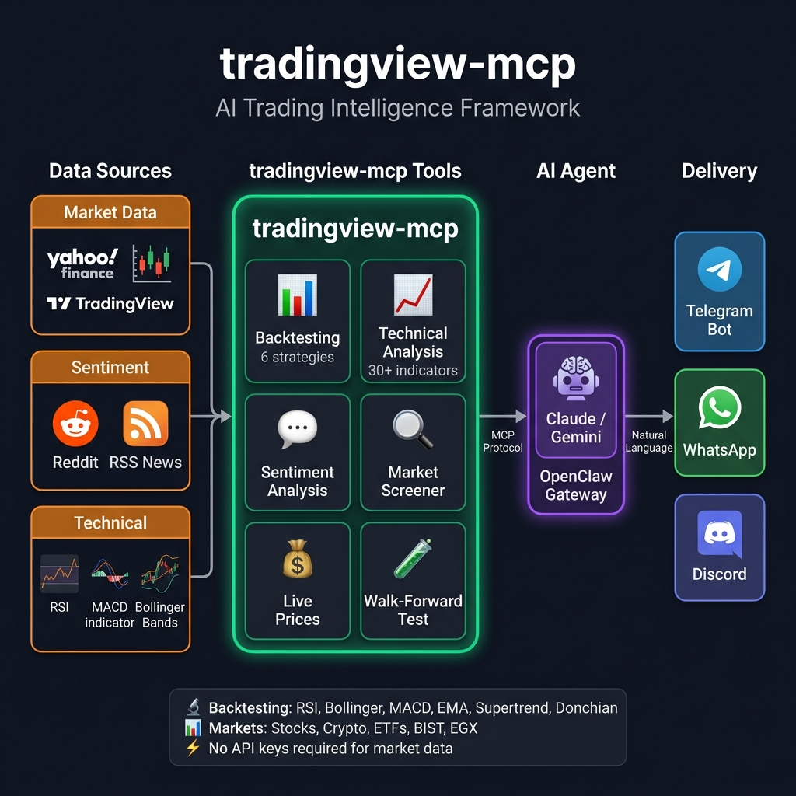

# TradingView MCP Market Data & Technical Analysis for AI Assistants

<a href="https://trendshift.io/repositories/25110" target="_blank"></a>

**TradingView MCP server** — real-time market data, technical indicators, screeners, and backtesting for Claude, ChatGPT, Cursor, Copilot, and any MCP client. Stocks, crypto, forex & futures across global exchanges.
Backtesting + live sentiment + Yahoo Finance + 30+ technical-analysis tools — the most complete TradingView MCP toolkit, all in one server.

<p align="center">
  
</p>

> [!NOTE]
> Independent open-source project — **not affiliated with, endorsed by, or associated with TradingView Inc.** "TradingView" is a trademark of its respective owner; this project consumes third-party market data and is not a TradingView product.

> [!NOTE]
> **Does it need — or risk — your TradingView account? No.** This server does **not** log into, scrape, or automate a TradingView session, and it requires no TradingView account or API key. Market data is fetched server-side from public endpoints, so there is no account of yours in the loop and no browser/UI automation. *(This is different from MCP servers that drive the TradingView Desktop app via Chrome DevTools.)* You are responsible for ensuring your own use complies with the terms of any data source you point it at.

> [!IMPORTANT]
> **Not financial advice.** Nothing produced by this software is investment, financial, legal, tax, or accounting advice. tradingview-mcp is an informational and educational analysis tool. Its outputs, including indicators, scores, signals, "trade setups", entries, stop losses, and targets, are computed from third party market data and are **not** recommendations to buy, sell, or hold any asset. It does not execute trades, manage money, or guarantee any result. Trading and investing carry a substantial risk of loss, and you can lose some or all of your capital. Always do your own research and consult a licensed professional before making any financial decision. You are solely responsible for your own decisions and for complying with the laws and regulations that apply to you. Market data may be delayed, inaccurate, or incomplete, and is provided without warranty.

> [!TIP]
> **Prefer zero setup? Use the hosted version.** [**pro.cryptosieve.com**](https://pro.cryptosieve.com) serves all 30+ tools as one connector URL for Claude.ai, ChatGPT, Copilot, and Cursor — no `uv`, `pandas`, or Python to wrangle. **From $9/mo (Pro) or $29/mo (Pro+ — higher limits), with a 3-day free trial.** Self-hosting stays free forever; hosted is just for folks who'd rather skip the ops. *(Full self-host vs hosted comparison in Quick Start below.)*

[](https://opensource.org/licenses/MIT)
[](https://www.python.org/downloads/)
[](https://modelcontextprotocol.com/)
[](https://openclaw.ai)
[](https://github.com/atilaahmettaner/tradingview-mcp/releases)
[](https://pypi.org/project/tradingview-mcp-server/)
[](https://github.com/sponsors/atilaahmettaner)

> **⭐ If this tool improves your workflow, please star the repo and consider [sponsoring](https://github.com/sponsors/atilaahmettaner) — it keeps the project alive and growing!**

<a href="https://github.com/sponsors/atilaahmettaner">
  
</a>
<a href="https://github.com/sponsors/atilaahmettaner">
  
</a>
<a href="https://github.com/sponsors/atilaahmettaner">
  
</a>

---

## 🎥 Framework Demo

https://github-production-user-asset-6210df.s3.amazonaws.com/67838093/478689497-4a605d98-43e8-49a6-8d3a-559315f6c01d.mp4

---

## 🆕 What's New

**Research Terminal — universal search, comparison & evidence-based analysis (Jul 2026)**

A local web terminal (`dashboard/app.py`) for researching **any** US stock/ETF/ADR
and major foreign listings — served at `http://127.0.0.1:5057`.

- **Universal ticker search** — a local security master (`dashboard/security_master.py`,
  ~30k symbols) with company-name, alias, former-name, foreign-suffix and typo-tolerant
  ranked search in **~9 ms** (was a 4–9 s per-keystroke provider call). `Apple`→AAPL,
  `Google`→GOOGL, `BRK B`→BRK.B, `NOKIA.HE` all resolve.
- **Comparison workspace** — compare 2–8 securities on one normalized schema:
  aligned %-performance, volatility, beta, drawdown, correlation, fundamentals,
  technicals — each panel degrades independently with an explicit *data unavailable* state.
- **Evidence-based analysis** — decision engine with independent signal families,
  EV gating, bull/base/bear scenarios, *what-changed-since-last-analysis*, and provenance.
- **Model registry** (`lab/model_registry.py`) — env-configurable financial sentiment
  (fast lexical default; optional `ProsusAI/finbert`), with recency/source/relevance-weighted
  aggregation + duplicate detection. Fails gracefully with no heavy deps.
- **Forecast benchmark** (`lab/forecast_benchmark.py`) — leakage-free walk-forward harness
  that gates any heavy time-series model against simple baselines before adoption.

Run: `python dashboard/app.py` → open `http://127.0.0.1:5057`. See
[`TERMINAL_AUDIT.md`](TERMINAL_AUDIT.md), [`MODEL_EVALUATION.md`](MODEL_EVALUATION.md),
[`DATA_PROVIDER_MATRIX.md`](DATA_PROVIDER_MATRIX.md) and
[`VERIFICATION_REPORT.md`](VERIFICATION_REPORT.md).

> **Terminal — remaining limitations.** HF forecasting / embeddings / anomaly models are
> declared and benchmark-gated but not enabled by default (no `torch`/`transformers` required
> to run). SEC CIK enrichment needs a compliant User-Agent (Finnhub supplies names/types
> meanwhile). Foreign-listing coverage is a curated seed plus whatever Yahoo resolves, not an
> exhaustive global master. Cold analysis panels show a `loading` placeholder for a few seconds
> while the decision engine computes.

---

**Stability & Strategy Expansion (May 2026)**

- **9 backtest strategies** (up from 6) — added `rsi_pullback`, `keltner_breakout`, and `triple_ema`, covering trend-pullback, ATR-normalized breakout, and SMA200-filtered EMA cross edges. `compare_strategies` now ranks the full 9.
- **Resilience layer** — automatic retry + 60-second TTL cache on the TradingView screener provider, eliminating transient `"Expecting value"` errors on `combined_analysis` and `multi_timeframe_analysis`. *(PR [#32](https://github.com/atilaahmettaner/tradingview-mcp/pull/32) — merged)*
- **Financial news service rebuild** — replaces deprecated Reuters RSS endpoints with Yahoo Finance, MarketWatch, and CNBC. Fixes the long-standing `count: 0` bug on `financial_news`. *(PR [#33](https://github.com/atilaahmettaner/tradingview-mcp/pull/33) — merged)*
- **TA throttle** — caps concurrent `tradingview_ta` calls (default 4) + min 0.8s spacing between starts. Prevents parallel bursts of `combined_analysis` / `multi_timeframe_analysis` from hitting TradingView's empty-body rate-limit cliff. Tunable via env vars. *(PR [#34](https://github.com/atilaahmettaner/tradingview-mcp/pull/34) — merged)*
- **Walk-forward backtesting** (`walk_forward_backtest_strategy`) — train/test split with overfitting verdict (ROBUST / MODERATE / WEAK / OVERFITTED).
- **Hourly (1h) timeframe** support across `backtest_strategy`, `compare_strategies`, and `walk_forward_backtest_strategy`.
- **Full trade log + equity curve** outputs (`include_trade_log=True`, `include_equity_curve=True`).

---

## 🏗️ Architecture



---

## ✨ Why tradingview-mcp?

| Feature | `tradingview-mcp` | Traditional Setups | Bloomberg Terminal |
|---------|-------------------|--------------------|--------------------|
| **Setup Time** | 5 minutes | Hours (Docker, Conda...) | Weeks (Contracts) |
| **Cost** | Free & Open Source | Variable | $30k+/year |
| **Backtesting** | ✅ 9 strategies + Walk-forward + Sharpe | ❌ Manual scripting | ✅ Proprietary |
| **Live Sentiment** | ✅ Reddit + RSS news | ❌ Separate setup | ✅ Terminal |
| **Market Data** | ✅ Live / Real-Time | Historical / Delayed | Live |
| **API Keys** | **None required** | Multiple (OpenAI, etc.) | N/A |

---

## 🚀 Quick Start (5 Minutes)

**Two ways to run it — the same 30+ tools either way:**

| | 🧑‍💻 Self-host (this repo) | ☁️ Hosted — [pro.cryptosieve.com](https://pro.cryptosieve.com) |
|---|---|---|
| **Price** | Free forever (MIT) | $9/mo Pro · $29/mo Pro+ · 3-day trial |
| **Time to first call** | ~5 minutes (Python + `uv`) | ~60 seconds (paste one URL) |
| **Updates & ops** | You run and update it | Managed — always on the latest |
| **Runs on** | Your machine or VPS | Hosted, streamed from the edge |
| **Limits** | Your hardware | 2,500/mo · 60/min (Pro) → 10,000/mo · 150/min (Pro+) |
| **Best for** | Tinkerers, forkers, full control | Folks who'd rather skip the ops |

> ☁️ **Zero setup:** paste one connector URL into Claude.ai, ChatGPT, Copilot, or Cursor → **[start a 3-day free trial](https://pro.cryptosieve.com)**. Everything below is for self-hosting.

### Install via pip
```bash
pip install tradingview-mcp-server
```

### Claude Desktop Config (`claude_desktop_config.json`)

> **Note:** On macOS, GUI apps like Claude Desktop may not have `~/.local/bin` in their PATH. Use the full path to `uvx` to avoid "command not found" errors.

```json
{
  "mcpServers": {
    "tradingview": {
      "command": "/Users/YOUR_USERNAME/.local/bin/uvx",
      "args": ["--from", "tradingview-mcp-server", "tradingview-mcp"]
    }
  }
}
```

On Linux, replace `/Users/YOUR_USERNAME` with `/home/YOUR_USERNAME`. On Windows, use `%USERPROFILE%\.local\bin\uvx.exe`.

### Codex Plugin Config

This repository also includes mcp-only Codex plugin metadata:

- `.codex-plugin/plugin.json`
- `.codex-mcp.json`

The plugin uses the same PyPI package entrypoint:

```json
{
  "mcpServers": {
    "tradingview": {
      "command": "uvx",
      "args": ["--from", "tradingview-mcp-server", "tradingview-mcp"]
    }
  }
}
```

After installing or enabling the Codex plugin, restart Codex so the MCP server is loaded in the next session. Depending on your Codex version, `codex mcp list` may show registered MCP servers, but tool availability should be verified in a fresh Codex session.

### Or run from source
```bash
git clone https://github.com/atilaahmettaner/tradingview-mcp
cd tradingview-mcp
uv run tradingview-mcp
```

---

## 🛠️ Troubleshooting

### 🪟 Windows: `MCP error -32001: Request timed out` on first launch

Symptom — you see this in the Claude Desktop logs shortly after adding the config:

```
[tradingview] Server started and connected successfully
[tradingview] Message from client: initialize ...
[60 seconds later]
[tradingview] notifications/cancelled — reason: "MCP error -32001: Request timed out"
```

**Why it happens:** on Windows with Python 3.14, `uvx` downloads `tradingview-mcp-server`, creates a fresh virtualenv, and installs dependencies the first time it runs. Because `pandas` has no prebuilt wheel for Python 3.14 yet, pip falls back to a source build — which typically exceeds Claude Desktop's 60-second MCP initialization timeout.

**Fix — pin to Python 3.13 (has prebuilt pandas wheels):**

```json
{
  "mcpServers": {
    "tradingview": {
      "command": "uvx",
      "args": ["--python", "3.13", "--from", "tradingview-mcp-server", "tradingview-mcp"]
    }
  }
}
```

On macOS use the full path to `uvx` (see the note in Quick Start). On Windows `uvx` is typically `%USERPROFILE%\.local\bin\uvx.exe`.

**Alternative — pre-install once, then let Claude Desktop reuse the cache:**

```bash
# Run in a terminal before launching Claude Desktop
uv tool install --python 3.13 tradingview-mcp-server
```

After the install finishes, start Claude Desktop with the normal config and the server will come up instantly (cache is already warm).

> _Credit: [@wyh4444](https://github.com/wyh4444) for the original report in [#24](https://github.com/atilaahmettaner/tradingview-mcp/issues/24)._

---

## ⚠️ Error Envelope Format

Tools that have adopted the structured error format return either their normal payload **or** an error envelope:

```json
{"error": {"code": "ALL_BATCHES_FAILED", "message": "All 5 batches failed; first error: JSONDecodeError(...)", "batches_attempted": 5, "batches_failed": 5, "first_error": "..."}}
```

**Why:** the previous `[]` / `{"error": "Analysis failed: ..."}` strings made it impossible to distinguish "no matches today" from "upstream rate-limit cliff." The new envelope is programmatically branchable by `code`.

**Currently adopted by:** `top_gainers`, `top_losers`, `rating_filter`, `volume_breakout_scanner`, `smart_volume_scanner`. More tools will follow in subsequent PRs.

**Detecting an error:**

```python
result = volume_breakout_scanner(exchange="KUCOIN")
if isinstance(result, dict) and "error" in result:
    code = result["error"]["code"]
    if code == "ALL_BATCHES_FAILED":
        # Wait + retry, raise alert, fall back to single-batch call, etc.
        ...
else:
    for row in result:
        ...
```

Stable codes are defined in [`core/errors.py`](src/tradingview_mcp/core/errors.py).

---

## 📱 Use via Telegram, WhatsApp & More (OpenClaw)

Connect this server to **Telegram, WhatsApp, Discord** and 20+ messaging platforms using [OpenClaw](https://openclaw.ai) — a self-hosted AI gateway. **Tested & verified on Hetzner VPS (Ubuntu 24.04).**

### How It Works

> OpenClaw routes Telegram messages to an AI agent. The agent uses `trading.py` — a thin Python wrapper — to call `tradingview-mcp` functions and return formatted results. **No MCP protocol needed between OpenClaw and the server; it's a direct Python import.**

```
Telegram → OpenClaw agent (AI model) → trading.py (bash) → tradingview-mcp → Yahoo Finance
```

### Quick Setup

```bash
# 1. Install UV and tradingview-mcp
curl -LsSf https://astral.sh/uv/install.sh | sh && source ~/.bashrc
uv tool install tradingview-mcp-server

# 2. Configure OpenClaw channels
cat > ~/.openclaw/openclaw.json << 'EOF'
{
  channels: {
    telegram: {
      botToken: "YOUR_BOT_TOKEN_HERE",
    },
  },
}
EOF

# 3. Configure gateway + agent
openclaw config set gateway.mode local
openclaw config set acp.defaultAgent main

# 4. Set your AI model (choose ONE option below)
openclaw configure --section model

# 5. Install the skill + tool wrapper
mkdir -p ~/.agents/skills/tradingview-mcp ~/.openclaw/tools
curl -fsSL https://raw.githubusercontent.com/atilaahmettaner/tradingview-mcp/main/openclaw/SKILL.md \
  -o ~/.agents/skills/tradingview-mcp/SKILL.md
curl -fsSL https://raw.githubusercontent.com/atilaahmettaner/tradingview-mcp/main/openclaw/trading.py \
  -o ~/.openclaw/tools/trading.py && chmod +x ~/.openclaw/tools/trading.py

# 6. Start the gateway
openclaw gateway install
systemctl --user start openclaw-gateway.service
```

### Choose Your AI Model

OpenRouter is **not required** — use whichever provider you have a key for:

| Provider | Model ID for OpenClaw | Get Key |
|----------|----------------------|---------|
| **OpenRouter** (aggregator — access to all models) | `openrouter/google/gemini-3-flash-preview` | [openrouter.ai/keys](https://openrouter.ai/keys) |
| **Anthropic** (Claude direct) | `anthropic/claude-sonnet-4-5` | [console.anthropic.com](https://console.anthropic.com) |
| **Google** (Gemini direct) | `google/gemini-2.5-flash` | [aistudio.google.com](https://aistudio.google.com) |
| **OpenAI** (GPT direct) | `openai/gpt-4o-mini` | [platform.openai.com](https://platform.openai.com) |

```bash
# Examples — set your chosen model:
openclaw config set agents.defaults.model "openrouter/google/gemini-3-flash-preview"  # via OpenRouter
openclaw config set agents.defaults.model "anthropic/claude-sonnet-4-5"               # Anthropic direct
openclaw config set agents.defaults.model "google/gemini-2.5-flash"                   # Google direct
```

> ⚠️ **Important:** Prefix must match your provider. `google/...` needs a Google API key. `openrouter/...` needs an OpenRouter key.

### ⚠️ Common Mistakes

| Symptom | Cause | Fix |
|---------|-------|-----|
| `Unrecognized keys: mcpServers` | `mcpServers` not supported in this version | Remove from config, use bash wrapper |
| `No API key for provider "google"` | Used `google/model` but only have OpenRouter key | Use `openrouter/google/model` instead |
| `which agent?` loop | `acp.defaultAgent` not set | `openclaw config set acp.defaultAgent main` |
| Gateway won't start | `gateway.mode` missing | `openclaw config set gateway.mode local` |

### Test Your Bot

Once running, send your Telegram bot:
```
market snapshot
backtest RSI strategy for AAPL, 1 year
compare all strategies for BTC-USD
```

👉 **[Full OpenClaw Setup Guide →](OPENCLAW.md)**

---


Unlike basic screeners, this framework deploys **specialized AI agents** that debate findings in real-time:

1. **🛠️ Technical Analyst** — Bollinger Bands (±3 proprietary rating), RSI, MACD
2. **🌊 Sentiment & Momentum Analyst** — Reddit community sentiment + price momentum
3. **🛡️ Risk Manager** — Volatility, drawdown risk, mean-reversion signals

*Output: `STRONG BUY` / `BUY` / `HOLD` / `SELL` / `STRONG SELL` with confidence score*

---

## 🔧 All 30+ MCP Tools

### 📊 Backtesting Engine

| Tool | Description |
|------|-------------|
| `backtest_strategy` | Backtest 1 of 9 strategies with institutional metrics (Sharpe, Calmar, Expectancy). Supports `1d` and `1h` timeframes; optional full trade log + equity curve. |
| `compare_strategies` | Run all 9 strategies on the same symbol and rank by performance. |
| `walk_forward_backtest_strategy` | Train/test split walk-forward validation with overfitting verdict (ROBUST / MODERATE / WEAK / OVERFITTED). |

**9 Strategies to Test:**
- `rsi` — RSI oversold/overbought mean reversion
- `bollinger` — Bollinger Band mean reversion
- `macd` — MACD golden/death cross
- `ema_cross` — EMA 20/50 Golden/Death Cross
- `supertrend` — ATR-based Supertrend trend following 🔥
- `donchian` — Donchian Channel breakout (Turtle Trader style)
- `rsi_pullback` — Dip-buy in confirmed uptrend (SMA50>SMA200 + RSI<40 entry) 🆕
- `keltner_breakout` — ATR-normalized breakout (EMA20 + 2·ATR upper band) 🆕
- `triple_ema` — EMA 20/50 cross gated by SMA200 trend filter 🆕

> 🆕 strategies require `period='1y'` or `'2y'` so the SMA200 trend filter can complete its warmup.

**Metrics you get:** Win Rate, Total Return, Sharpe Ratio, Calmar Ratio, Max Drawdown, Profit Factor, Expectancy, Best/Worst Trade, vs Buy-and-Hold, with **realistic commission + slippage simulation**.

```
Example prompt: "Compare all 9 strategies on MSFT for 2 years"
→ #1 triple_ema:        +15.1% | Sharpe:  0.0 | WR: 100%
→ #2 keltner_breakout:  +14.3% | Sharpe:  4.7 | WR:  40%
→ #3 bollinger:         +12.2% | Sharpe:  4.1 | WR:  64%
→ Buy & Hold:            -2.1%
```

---

### 💰 Yahoo Finance — Real-Time Prices *(New in v0.6.0)*

| Tool | Description |
|------|-------------|
| `yahoo_price` | Real-time quote: price, change %, 52w high/low, market state |
| `market_snapshot` | Global overview: S&P500, NASDAQ, VIX, BTC, ETH, EUR/USD, SPY, GLD |

**Supports:** Stocks (AAPL, TSLA, NVDA), Crypto (BTC-USD, ETH-USD, SOL-USD), ETFs (SPY, QQQ, GLD), Indices (^GSPC, ^DJI, ^IXIC, ^VIX), FX (EURUSD=X), Turkish (THYAO.IS, SASA.IS)

---

### 🧠 AI Sentiment & Intelligence

| Tool | Description |
|------|-------------|
| `market_sentiment` | Reddit sentiment across finance communities (bullish/bearish score, top posts) |
| `financial_news` | Live RSS headlines from Yahoo Finance, MarketWatch, CNBC, CoinDesk, CoinTelegraph |
| `combined_analysis` | **Power Tool**: TradingView technicals + Reddit sentiment + live news → confluence decision. Now backed by retry + 60s cache for resilience against transient screener errors. |

---

### 📈 Technical Analysis Core

| Tool | Description |
|------|-------------|
| `get_technical_analysis` | Full TA: RSI, MACD, Bollinger, 23 indicators with BUY/SELL/HOLD |
| `get_multiple_analysis` | Bulk TA for multiple symbols at once |
| `get_bollinger_band_analysis` | Proprietary ±3 BB rating system |
| `get_stock_decision` | 3-layer decision engine (ranking + trade setup + quality score) |
| `screen_stocks` | Multi-exchange screener with 20+ filter criteria |
| `scan_by_signal` | Scan by signal type (oversold, trending, breakout...) |
| `get_candlestick_patterns` | 15 candlestick pattern detector |
| `get_multi_timeframe_analysis` | Weekly→Daily→4H→1H→15m alignment analysis |

---

### 🌍 Multi-Exchange Support

| Exchange | Tools |
|----------|-------|
| **Binance** | Crypto screener, all pairs |
| **KuCoin / Bybit+** | Crypto screener |
| **NASDAQ / NYSE** | US stocks (AAPL, TSLA, NVDA...) |
| **EGX (Egypt)** | `egx_market_overview`, `egx_stock_screener`, `egx_trade_plan`, `egx_fibonacci_retracement` |
| **Turkish (BIST)** | Via TradingView screener |
| **NSE/BSE (India)** | `india_market_overview`, `india_sector_scan`, `india_sector_scanner`, `india_index_analysis`, `india_stock_screener`, `india_trade_plan`, `india_fibonacci_retracement`, plus `nse_option_chain` / `nse_options_unusual_activity` for F&O |

---

## 🇮🇳 Indian Market (NSE/BSE)

Full NSE/BSE coverage, built the same way as the EGX module but with one
upgrade: sector and index membership is resolved **live** against
TradingView's `india` scanner (by free-float market-cap ranking within a
sector/industry filter) instead of a static, slowly-staling ticker list.

| Tool | Description |
|------|-------------|
| `india_market_overview` | Top gainers/losers/most-active across the top 600 NSE stocks by market cap |
| `india_sector_scan` | Scan by sector/index group (BANKNIFTY, NIFTYIT, NIFTYPHARMA, NIFTYAUTO, NIFTYFMCG, NIFTYMETAL, NIFTYREALTY, NIFTYFINSERVICE) or any raw TradingView sector name |
| `india_sector_scanner` | Sector-rotation heatmap — Hot/Warming/Cooling/Cold, live market-cap-weighted, with top stock picks per hot sector |
| `india_index_analysis` | Constituent breakdown for NIFTY50, BANKNIFTY, SENSEX30, NIFTYIT, and 6 more, plus the index's own live level |
| `india_stock_screener` | Ranks NSE stocks by a 0-100 stock score with entry/stop/target trade setups |
| `india_trade_plan` | Full trade plan (score, setup, stop-loss, targets, R:R) for one NSE/BSE stock |
| `india_fibonacci_retracement` | Fibonacci retracement/extension levels for one NSE/BSE stock |
| `nse_option_chain` | NIFTY/BANKNIFTY/FINNIFTY/stock option chain with PCR and max pain, from NSE India's public API |
| `nse_options_unusual_activity` | Top strikes by volume/OI ratio with Long/Short Buildup classification |

The generic tools also work for India out of the box — pass `exchange="NSE"`
to `coin_analysis`, `top_gainers`, `multi_agent_analysis`,
`combined_analysis`, `multi_timeframe_analysis`, or use a `.NS`/`.BO` symbol
(`RELIANCE.NS`) with `yahoo_price` / `backtest_strategy`. Index aliases like
`NIFTY`, `BANKNIFTY`, `SENSEX`, `NIFTYIT` resolve automatically to the right
Yahoo/TradingView symbol in every tool.

> [!NOTE]
> **NSE options data reliability.** `nse_option_chain` and
> `nse_options_unusual_activity` call NSE India's own public website API —
> no key needed, but it sits behind aggressive Akamai bot-protection. It
> works well from most residential/office networks in India; from
> cloud/datacenter IPs it can intermittently return a clear
> `NSE_BLOCKED_OR_UNAVAILABLE` error instead of data. If that happens
> consistently, the reliable fix is a licensed broker API (Zerodha Kite
> Connect / Upstox / Angel One), not a different scraping approach — see the
> Paper Trading section below for how a broker would plug in.

---

## 🎯 $500 Strategy Account (momentum/breakout engine + dashboard)

An operational implementation of a small-account, high-conviction swing-trading
strategy — capital preservation first, only high-quality momentum/breakout setups
on liquid U.S. equities and their options, every trade with a defined entry, stop,
target(s), and ≥2:1 reward:risk. It runs on a dedicated `strategy-500` paper account.

| Tool | Description |
|------|-------------|
| `strategy_setup_account` | Create (or `reset=True` to wipe) the dedicated $500 paper account. |
| `strategy_find_trades` | Screen the liquid US universe for qualifying LONG momentum/breakout setups and return ranked, **pre-sized** trade cards (entry, ATR-based stop, 2R/3R targets, share/contract size) — each with a defined-risk call-option idea when one fits the risk caps. Nothing is executed. |
| `strategy_status` | Full account snapshot: cash, stock + option positions (live mark-to-market), total equity, return %, and journal stats (open/closed, win rate, realized P&L). |
| `strategy_log_trade` | Journal a committed trade's thesis, entry, stop, targets, R:R, and risk. |
| `strategy_close_trade` | Close a journaled trade with its realized P&L + review notes (feeds win-rate/expectancy). |

**Risk model (Balanced):** ≤5% of equity at risk per trade (~$25 on $500), ≤25%
committed per trade (~$125), minimum 2:1 R:R enforced by construction. All limits
read the account's *live* balance, so they scale as it grows or shrinks. The engine
only ever proposes candidates — you review and commit via `paper_trade` /
`paper_option_trade` (with `user_id="strategy-500"`), honoring the strategy's rule
that no capital is committed without a documented thesis.

### Local dashboard

A small Flask app (`dashboard/app.py`) renders the whole account in a browser so you
can *see* it without asking in chat — live equity, return %, cash, open stock + option
positions with mark-to-market P&L, the full trade journal, and an on-demand "Find
trades now" button that runs the live screener. It reads the same local SQLite ledger.

```bash
python tradingview-mcp/dashboard/app.py     # then open http://127.0.0.1:5057
```

(Or launch it through the Claude preview tooling via `.claude/launch.json`.)

---

## 📝 Paper Trading & Order Routing

A single order-entry point with two modes:

| Tool | Description |
|------|-------------|
| `place_order` | `mode="paper"` (default) simulates the fill locally. `mode="live"` routes to the configured broker — a clear "not configured" error unless one is wired up (see below). |
| `paper_trade` | Simulated BUY/SELL directly — fills at live market price unless you pass one, tracked in a local SQLite ledger (`~/.tradingview_mcp_data/portfolio.db`) starting at $10,000 notional. |
| `paper_portfolio` | Cash balance, open positions, and live mark-to-market unrealized P&L. |
| `paper_trade_history` | Past simulated fills with realized P&L per SELL. |
| `paper_option_trade` | Simulated options BUY (open)/SELL (close) — fills at the live option chain premium (last trade or bid/ask midpoint), 100-share contract multiplier. |
| `paper_option_portfolio` | Open option positions (underlying, strike, expiry, type) with live mark-to-market P&L per contract. |
| `paper_option_trade_history` | Past simulated option fills with realized P&L per SELL. |
| `broker_status` | Reports whether real order execution is available, and Axis Direct/Robinhood session state if configured. |
| `axisdirect_login_start` / `axisdirect_login_complete` | Two-step SSO login for Axis Direct — see below. |
| `robinhood_login` | One-step login for Robinhood (username/password from `.env` + optional TOTP code) — see below. |
| `broker_positions` / `broker_holdings` | Live positions/holdings from the configured broker. |

**Options backtesting was intentionally not built.** There's no free source of
*historical* option chains — Yahoo and NSE both only expose today's chain, never
what it looked like on a past date. A backtest built on that would have to
theoretically reconstruct past option prices (e.g. Black-Scholes + historical
realized volatility as a stand-in for real IV) — which is a legitimate technique
elsewhere, but easy to mistake for a real historical track record when it's really
a model's opinion. `paper_option_trade` instead uses **real, live option chains**
(via `stock_options_chain`'s data source) so every fill and every mark-to-market
number reflects an actual market price at the time — no approximation, just forward
paper trading instead of backward backtesting.

**No real orders are placed by this server unless you explicitly configure a broker.**
`BROKER_PROVIDER` defaults to `none`, and every live-mode call raises a clear
"not configured" error rather than silently no-op'ing.

**Axis Direct is implemented** (via the community `rapidapi-axisdirect` SDK — not an
official Axis Direct library) but **untested against the live API**, since no real
credentials were available while building it — verify carefully with a small order
first. Going live takes about 5 minutes once you have real credentials from Axis
Direct's RAPID API portal, with no code changes:

1. `pip install rapidapi-axisdirect` (or `pip install -e ".[axisdirect]"`)
2. In `.env`: `BROKER_PROVIDER=axisdirect`, `AXISDIRECT_CLIENT_ID=...`, `AXISDIRECT_AUTHORIZATION_KEY=...`
3. Call `axisdirect_login_start` with a redirect URL you control, open the returned
   login URL, log in with your Axis Direct credentials
4. Copy the `ssoId` query parameter from the redirect, call `axisdirect_login_complete(sso_id=...)`
   — the session (plus a refresh token) is cached to
   `~/.tradingview_mcp_data/axisdirect_session.json` and auto-refreshes afterwards
5. `place_order(mode="live", ...)`, `broker_positions`, and `broker_holdings` now hit Axis Direct

> [!WARNING]
> **Robinhood is implemented for US market execution, but read this before using it.**
> - **No paper mode exists on Robinhood at all.** Every `place_order(mode="live", ...)`
>   call is a real order with real money, immediately — there is no way to simulate
>   first, unlike every other integration in this project.
> - **Unofficial and against Robinhood's Terms of Service.** It wraps the community
>   `robin_stocks` SDK, which replays Robinhood's private mobile-app API. Robinhood
>   has never authorized third-party use of this, and accounts have been flagged or
>   restricted for it before.
> - **Credentials are your real username/password**, not an issued API key — there's
>   no OAuth flow.
> - **Untested against the live API**, same as Axis Direct, for the same reason (no
>   real credentials available while building it).
>
> Setup, only if you've accepted all of the above:
> 1. `pip install robin_stocks` (or `pip install -e ".[robinhood]"`)
> 2. In `.env`: `BROKER_PROVIDER=robinhood`, `ROBINHOOD_USERNAME=...`, `ROBINHOOD_PASSWORD=...`
> 3. Call `robinhood_login` (pass `mfa_code` if you use an authenticator app — SMS/email
>    code prompts and app push-approval aren't supported; see the note below)
> 4. `place_order(mode="live", ...)` now places real Robinhood orders
>
> **Why some 2FA methods aren't supported:** Robinhood's login flow can, on an
> untrusted device, demand an SMS/email code typed into a live prompt or a push
> notification approved in the app — both implemented by `robin_stocks` as *blocking*
> calls (literally Python's `input()`, or polling for up to 2 minutes). Since this MCP
> server's own transport is stdio, letting that block in-process risked hanging or
> corrupting the live connection you're using right now. Every Robinhood call here
> instead runs in an isolated subprocess with `stdin` closed and a ~25s timeout, so
> those flows fail cleanly with a timeout error instead of ever risking the server —
> but that means accounts requiring interactive verification on this device won't work
> through this integration at all.

To wire up a different broker (Zerodha Kite Connect, Upstox, Angel One — not yet
implemented): add credentials to `.env`, implement a `BrokerAdapter` subclass under
`core/broker/<provider>.py` (mirroring `axisdirect.py` or `robinhood.py`), and add one
`elif` branch to `get_broker()` in `core/broker/base.py`. Until any of this is done,
every trade idea from the screener, sector scanner, or trade-plan tools above can be
tested risk-free through `paper_trade`.

---

## 💬 Example AI Conversations

```
You: "Give me a full market snapshot right now"
AI: [market_snapshot] → S&P500 -3.4%, BTC +0.1%, VIX 31 (+13%), EUR/USD 1.15

You: "What is Reddit saying about NVDA?"
AI: [market_sentiment] → Strongly Bullish (0.41) | 23 posts | 18 bullish

You: "Backtest RSI strategy on BTC-USD for 2 years"
AI: [backtest_strategy] → +31.5% return | 100% win rate | 2 trades | B&H: -5%

You: "Which of the 9 strategies worked best on MSFT in the last 2 years?"
AI: [compare_strategies] → triple_ema #1 (+15.1%, WR 100%), keltner_breakout #2 (+14.3%), macd last (-23.4%)

You: "Run walk-forward backtest on supertrend for SPY"
AI: [walk_forward_backtest_strategy] → Verdict: ROBUST (avg robustness 0.92) | OOS return +8.5%

You: "Analyze TSLA with all signals: technical + sentiment + news"
AI: [combined_analysis] → BUY (Technical STRONG BUY + Bullish Reddit + Positive news)

You: "How's the Indian market doing today, any hot sectors?"
AI: [india_sector_scanner] → NIFTYIT Hot (+0.67% avg, inflow), BANKNIFTY Hot (+0.10%, inflow) — 3 qualified picks in IT

You: "What's the NIFTY option chain looking like, PCR and max pain?"
AI: [nse_option_chain] → PCR 1.12 (mildly bullish), max pain 24,100, underlying 24,128

You: "Paper buy 10 shares of RELIANCE"
AI: [paper_trade] → BUY 10 RELIANCE @ ₹1,309.20 (live market fill) | balance ₹86,908 remaining
```

---

## 💖 Support the Project

This framework is **free and open source**, built in spare time. If it saves you hours of research or helps you make better decisions, please consider sponsoring:

| Tier | Monthly | What You Get |
|------|---------|--------------|
| ☕ Coffee | $5 | Heartfelt gratitude + name in README |
| 🚀 Supporter | $15 | Above + priority bug fixes |
| 💎 Pro | $30 | Above + priority feature requests |

<a href="https://github.com/sponsors/atilaahmettaner">
  
</a>

Every sponsor directly funds new features like Walk-Forward Backtesting, Twitter/X sentiment, and managed cloud hosting.

---

## 📋 Roadmap

- [x] TradingView technical analysis (30+ indicators)
- [x] Multi-exchange screener (Binance, KuCoin, MEXC, EGX, US stocks)
- [x] Reddit sentiment analysis
- [x] Live financial news (Yahoo / MarketWatch / CNBC / CoinDesk / CoinTelegraph)
- [x] Yahoo Finance real-time prices
- [x] Backtesting engine (9 strategies + Sharpe / Calmar / Expectancy)
- [x] Walk-forward backtesting (overfitting detection)
- [x] Resilience layer (retry + TTL cache) on screener provider
- [x] Hourly (1h) backtesting timeframe
- [x] India (NSE/BSE) market module — sector scan/rotation, index analysis, screener, trade plans, Fibonacci
- [x] NSE F&O options chain (PCR, max pain, unusual OI activity)
- [x] Paper trading simulation (local SQLite ledger + live mark-to-market P&L)
- [x] Axis Direct live order execution (community SDK) — implemented, untested against live API
- [x] Robinhood live order execution (community SDK) — implemented, untested, no paper mode, unofficial/ToS risk
- [ ] Twitter/X market sentiment
- [ ] Zerodha / Upstox / Angel One / Alpaca broker adapters (interface ready, not yet implemented)
- [ ] Managed cloud hosting (no local setup)

---

## 📄 License

MIT License — see [LICENSE](LICENSE) for details.

---

*Disclaimer: This tool is for educational and research purposes only. It does not constitute financial advice. Always do your own research before making investment decisions.*
